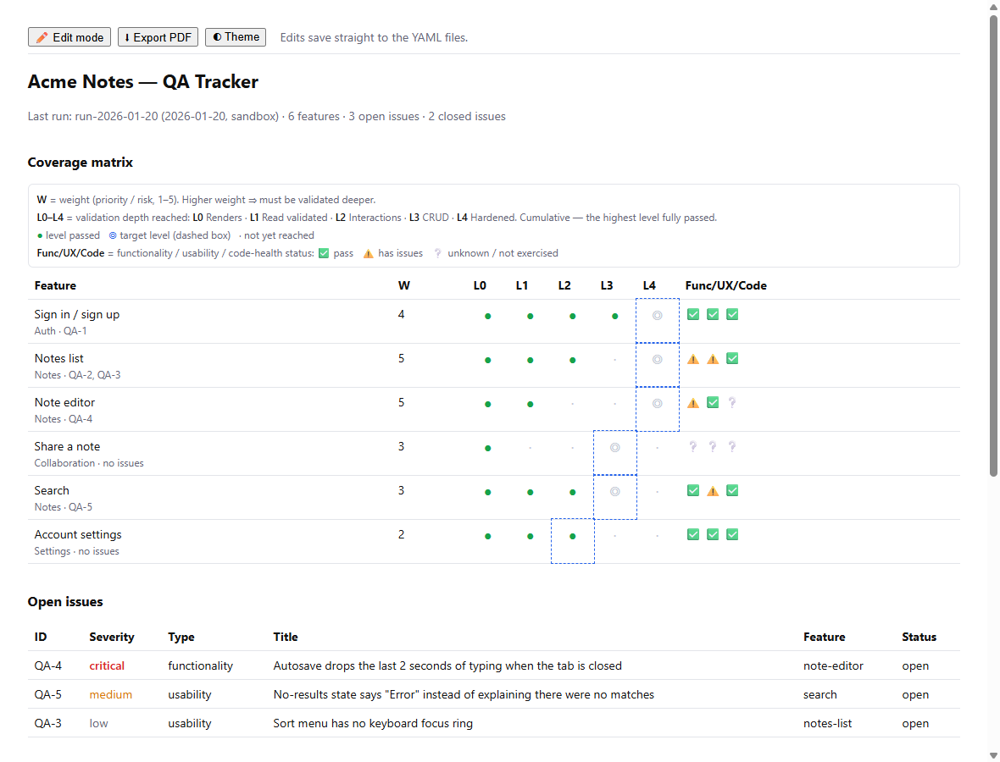

# qa-tracker

**Evidence-based QA coverage tracking in plain YAML.** Track how deeply every
feature of your product has actually been verified — not which lines a unit test
touched, but whether someone (or some agent) clicked through it, on what data,
and what they found.

[](https://github.com/Kadreev/qa-tracker/actions/workflows/ci.yml)
[](https://www.npmjs.com/package/qa-tracker)
[](LICENSE)



- **A coverage matrix** — one row per feature, with a weight (how much it matters)
  and a level on a five-step validation ladder, L0 *renders* → L4 *hardened*.
- **Evidence or it didn't happen** — a level only rises through a recorded QA run,
  and a read-only run can never certify anything that writes data.
- **Findings are permanent** — never deleted, only re-statused, linked to features.
- **A UI surface checklist** (optional) — every view, tab, dialog and button, so the
  things nobody has ever pressed show up as ⬜ instead of hiding under "L2".
- **Built for AI agents** — a CLI that validates every write, a generated
  `STATUS.md` any model can read, and an `AGENTS.md` with the rules.
- **Built for people** — a local dashboard to adjust priorities and statuses and
  export a PDF for the team.
- **Just files in your repo** — reviewable in pull requests, diffable, no server,
  no account. One runtime dependency (`yaml`).

## Quick start

```bash
npx qa-tracker init                      # creates ./qa-tracker with empty data files
npx qa-tracker add-feature sign-in --name "Sign in" --area Auth --weight 4
npx qa-tracker add-feature search  --name "Search"  --area Core --weight 3
npx qa-tracker serve                     # dashboard at http://localhost:4300
```

After a QA pass (by you, a teammate or an agent):

```bash
npx qa-tracker add-issue --feature sign-in --severity high --title "Login button does nothing on Safari"
npx qa-tracker add-run --blast-radius sandbox --levels sign-in=L2,search=L1 --opened QA-1
npx qa-tracker plan                      # what to validate next, ranked
```

Every write validates the whole dataset first and regenerates `STATUS.md`. Commit
the `qa-tracker/` directory like any other code.

Want to look around first? Clone the repo and run `npm run demo` to open the
[Acme Notes demo](examples/demo/STATUS.md).

## The model

### The validation ladder

Each feature has a `current_level` (the highest level whose checks **fully
passed** in a recorded run) and a `target_level` (how deep it should go).

| Level | Passes when |
|---|---|
| L0 | Renders; no console errors or blank states |
| L1 | Displayed data is correct and internally consistent |
| L2 | Non-mutating interactions work (filters, tabs, modals, sort) |
| L3 | Create, edit, delete and run exercised and verified |
| L4 | Edge cases, empty and error states, concurrency, regressions re-checked |

The ladder is cumulative: if an L1 check fails, the feature is L0 however well L2
went. The target defaults from the feature's weight (4–5 → L4, 3 → L3, 1–2 → L2).

### Features, issues, runs

| File | Holds | Who writes it |
|---|---|---|
| `features.yaml` | The matrix rows: weight, target, current level, quality dimensions (functionality, usability, code health), linked issues | People own `weight`, `target_level`, `name`, `area`, `routes`. Runs own the rest |
| `issues.yaml` | Every finding: severity, type, feature, status (`open` → `fixed` → `verified-fixed`, or `wont-fix`) | Anyone; never delete, only re-status |
| `runs.yaml` | Append-only log of QA runs: blast radius, level changes, issues opened and verified | Whoever ran it |
| `surfaces/*.yaml` | Optional nested UI checklist with a verdict per surface | People describe; runs record verdicts |

`STATUS.md` and `SURFACES.md` are generated from those files. Don't edit them by hand.

### The rules (enforced by `qa-tracker validate`)

1. **No run, no level bump.** `current_level` only moves through `add-run --levels`.
2. **Read-only runs cap at L2** and can only pass surfaces whose effect is `read`
   or `navigate`. L3/L4 need a `sandbox` or `test-account` run, never real data.
3. **People own priority.** A run never overwrites `weight` or `target_level`.
4. **Findings are permanent.** Ids are never reused or renumbered.
5. **References resolve.** Every issue points at a real feature, every verdict at
   a real run, and every `component`/`test_refs` path at a file that exists, so the
   tracker can't quietly outlive the code it describes.

Full schema: [docs/SCHEMA.md](docs/SCHEMA.md).

## Using it with AI agents

qa-tracker was built for agent-driven QA, where a model drives a browser through
your app and reports back. Without guard rails, agents tend to declare things
"working" on thin evidence. The tracker turns that into a contract the agent can't
skip: findings need a feature, levels need a run, and a read-only pass can't
certify a delete button.

- `init` writes **`qa-tracker/AGENTS.md`**, the rules and the commands. Point your
  agent at it, or reference it from your root `AGENTS.md` / `CLAUDE.md`.
- A ready-made **skill** lives in [`skills/qa-tracker/SKILL.md`](skills/qa-tracker/SKILL.md).
  Copy it to `.claude/skills/qa-tracker/` (Claude Code) or `.agents/skills/qa-tracker/`
  (Codex and others).
- For browser agents, `qa-tracker surfaces --json` gives each surface's id and
  `expected` text. Hand a list to each agent and ask for a verdict per id:

```bash
npx qa-tracker verdict notes.list.sort broken --run run-2026-01-20 --issues QA-3
npx qa-tracker verdict notes.list.empty blocked --run run-2026-01-20 --notes "needs a fresh account"
```

Everything has a `--json` mode, and every command exits non-zero on rejection.

## CLI

| Command | Does |
|---|---|
| `init [--title T]` | Scaffold the data directory |
| `serve [--port 4300] [--host 127.0.0.1]` | Local dashboard: edit weights, re-verify flags and issue statuses; export PDF |
| `status` | Print the Markdown snapshot |
| `plan [--json]` | Features ranked by `weight × levels below target`, plus re-verify |
| `get <id> [--json]` | One feature, issue or run |
| `validate` | Check every rule; non-zero exit on any error |
| `add-feature <id> --name --area [--weight] [--target] [--routes a,b]` | New matrix row at L0 |
| `add-issue --feature --severity --title [--type] [--id] [--source]` | New finding (ids default to `QA-n`), linked from its feature |
| `add-run --blast-radius [--levels f=L2,g=L3] [--features] [--opened] [--verified] [--profiles] [--report]` | Record a run and apply it: levels, `last_validated`, `verified-fixed` |
| `set <feature> weight\|target\|reverify\|functionality\|usability\|code_health <value>` | Edit a feature field |
| `set <issue> status <open\|fixed\|verified-fixed\|wont-fix>` | Re-status a finding |
| `surfaces [--json]`, `surface <id>` | The UI checklist |
| `verdict <surface> <pass\|broken\|blocked\|unchecked> --run <id> [--issues] [--notes]` | Record a surface verdict |
| `render` | Regenerate `STATUS.md` / `SURFACES.md` |

Global options: `--dir <path>` (default `./qa-tracker`, or `$QA_TRACKER_DIR`) and
`--root <path>`.

## Configuration

`qa-tracker/qa-tracker.config.json` (optional, written by `init`):

```json
{
  "title": "Acme Notes — QA Tracker",
  "root": ".."
}
```

`root` is the repository root that surface paths (`component`, `test_refs`)
resolve against, relative to the data directory.

## In CI

Fail the build when the tracker is invalid or `STATUS.md` is stale:

```yaml
- run: npx qa-tracker validate
- run: npx qa-tracker render && git diff --exit-code qa-tracker/STATUS.md
```

## The dashboard

`qa-tracker serve` serves the matrix, open and closed issues, the surface
roll-up and the next-run plan. In **Edit mode** you can change weights, toggle
re-verify and re-status issues. Each edit is validated and written straight back
to the YAML, keeping comments and formatting. **Export PDF** uses the browser's
print dialog.

The server binds to `127.0.0.1` and only accepts same-origin JSON requests with a
loopback `Host`, so a web page you visit can't write to your tracker.
Adding features, issues and runs stays a CLI action.

## Programmatic API

```js
import { resolveConfig, createStore, nextRunPlan } from 'qa-tracker';

const store = createStore(resolveConfig({ dir: 'qa-tracker' }));
const data = store.data();                    // { features, issues, runs, surfaces }
console.log(nextRunPlan(data)[0]);
const res = store.commit({ kind: 'issue-status', issue: 'QA-1', value: 'fixed' });
if (!res.ok) throw new Error(res.error);
```

## FAQ

**How is this different from a test management tool?** Those manage test cases
and executions. qa-tracker answers a coarser, more useful question: *for each
feature, how far has it been verified, and on what evidence?* It lives in your
repo, it is small enough for an agent to read in one go, and it refuses claims
the evidence doesn't support.

**Does it replace my issue tracker?** No. Keep tracking work in GitHub, Linear or
Jira, and reuse their ids (`GH-123`) in `issues.yaml`. The tracker records which
feature a finding hurts and whether a run has re-checked the fix.

**Does it need a browser?** Only the optional dashboard does. Everything else is
the CLI and plain files.

## Contributing

Issues and pull requests are welcome. See [CONTRIBUTING.md](CONTRIBUTING.md).
`npm test` runs the suite (Node ≥ 20, no other setup).

## Origin

qa-tracker was extracted from the QA process of
[Stability Monitor](https://stabilitymonitor.com), where it tracks AI browser agents
validating a large web app.

## License

[MIT](LICENSE)
